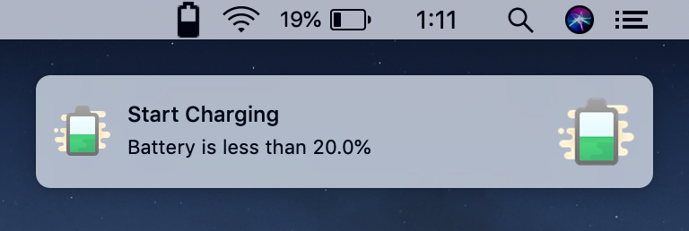
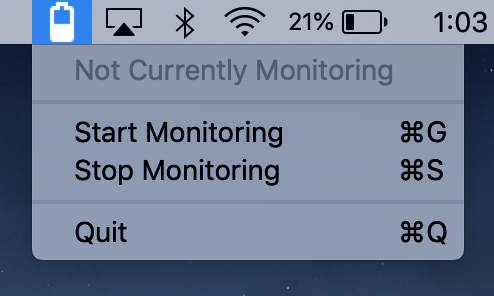

# Charge Notifs
A minimalist menu-bar app for macOS that notifies you to stop charging when your battery level is above 80% and to start charging when it's below 20%.

Unfortunately, this is only available on macOS Mojave 10.14 since I currently can't figure out a workaround for registering for APNs without an Apple Developer account. If you do, feel free to create a pull request!

I'm a newbie to Swift and creating apps, so if you have any recommendations or tips, feel free to let me know!

## Installation
Available only on macOS 10.14 Mojave.
Download app zip file from the [releases][dl-link] page.
